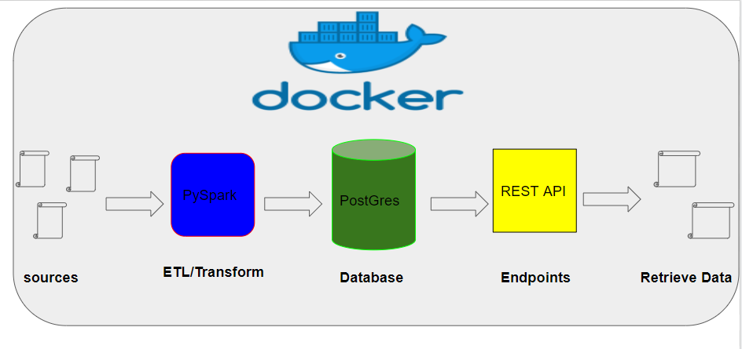

### The whole project is about doing some ETL job with json file and the retrieve the data from postgres through API 

The architecture:




## Project Structure:
```
-etl
    -src
	-configs
		-etl_config.json
	-job
		-etl_job.py
    -resources
	-data.json
	-postgresdriver.jar

    -docker-compose.yml
```

etl_config.json : The confguration details for the database and input data

etl_job.py : The etl job module which will trigger the ETL pipeline

data.json : This is the input json data

postgresdriver.jar: The driver file for postgres JDBC connection.

docker-compose.yml : The docker compose file that will start the spark container and the postgres database.

## START THE APP

a) Necessary changes in docker-compose.yml file:
	1. Open the file and change the follwing details in pyspark-notebook container:
		-     volumes:
        		- '$YOUR_DIRECTORY_PATH/data-engineer-challenge-python/data-engineer-challenge-python/etl:/home/jovyan/work'

	*** This will link you local working directory into the spark container working directory. Any changes in the local directory now will also be changed in the container directory.

	2. Up the docker containers using follwoing command from the /etl folder:
		- docker-compose up

b) Now all the container will be running. The containers are:
	1. pyspark-notebook
	2. postgres
	3. pgAdminer(to access the database UI)

## RUN THE ETL JOB

a) After running the containes we can see all the containers are running and now we can submit our etl spark job using the follwing command:
```
		-> docker exec -i -t "container_id*" /usr/local/spark/bin/spark-submit --driver-class-path "jdbc postgres driver path" --jars "jdbc postgres driver path" "etl job py file "
		
		-> Example: docker exec -i -t 70e3fa090d7d /usr/local/spark/bin/spark-submit --driver-class-path /home/jovyan/work/resources/postgresql-42.2.5.jre6.jar --jars /home/jovyan/work/resources/postgresql-42.2.5.jre6.jar /home/jovyan/work/src/job/etl_job.py
```


* Container id can be found using "docker ps -all"

Actually, you should run the example command from the above line just changing the container id , it will start the job and finish it. 
Then you can check the created data that saved int the postgres sql table by visiting Adminer container:
```	
		-> http://localhost:8080/
```
That is it. Now we can use the API service to get the data. Remember the continer should be running as the postgres should be running.

N.B: if you want to change the database details or input data then please chage into the etl_config.json file. It will be automatically loaded when the etl job starts


### API CREATION AND TESTING
# Project Structure:

```
-app
    -app.py
    -init.py
    -unit_test.py
    -Dockerfile
    -config_restapi.json
```
## Module Details

app.py - this is main rest api service file. It will be used for starting the api.

init.py - the support file for the app.py. It will create the rest app and read the configuration for the database.

unit_test.py - The module for testing the api. It is possible to test by providing a customer id and their expected result. 

Dockerfile - This is to dockerize the api and keep it running for further interactions. 

config_restapi.json - this is the config file for the app. The database configuration details is there and also one test configuration. 


## Start the API

1. The following command has to be executed from the api/ folder:

		1. Dockerize the api app with following command:
			-> docker build -t "app name" .
			-> Example:  docker build -t takeway-restapi .

		2. After dockerizing the api, the docker app needs to run with the following command:
			->  docker run -p container_port:expose_port -v "api_files_folder_path":/"docker_container_path" --network "postgres_container_network_from_etl_docker_compose" "api_container_name"
			->  Example: docker run -p 5000:5005 -v /mnt/c/Users/KamrulHasan/Documents/repo/data-engineer-challenge-python/data-engineer-challenge-python/api:/app --network src_pyspark-net takeway-restapi
		
		3. Now, the api will be running from in http://127.0.0.1:5005. It is possibe to access and test with the endpoint http://127.0.0.1:5000/spend/{customer_id}
			
			-> Example: http://127.0.0.1:5000/spend/5b6950c01a9cb631656ef441
			-> Resuslt for mentioned endpoints and customer_id: {
 					"customerId": "5b6950c01a9cb631656ef441", 
  					"orders": 8, 
  					"totalNetMerchandiseValueEur": 103.58
				    }
		4. I have also wrote a test module with python unitesting. After doing the step 1 and 2 then we can test by running following command. The test details like customer id and expected result can be altered from the config_restapi.json file.

			-> docker exec -ti "container_name" python3 unit_test.py
			-> Example: docker exec -ti stupefied_lehmann python3 unit_test.py
			# container_name can be found by running the following command
			-> docker ps -all

N.B: It is possible to run the app just using all the example command stated above. It is also possible to run this api from local machine without dockerizing but i would not recommend as you need to install all the dependencies mentioned in requirements.txt and create a virtual environment. 

Thank you. For any help please email: hasan.alive@gmail.com


